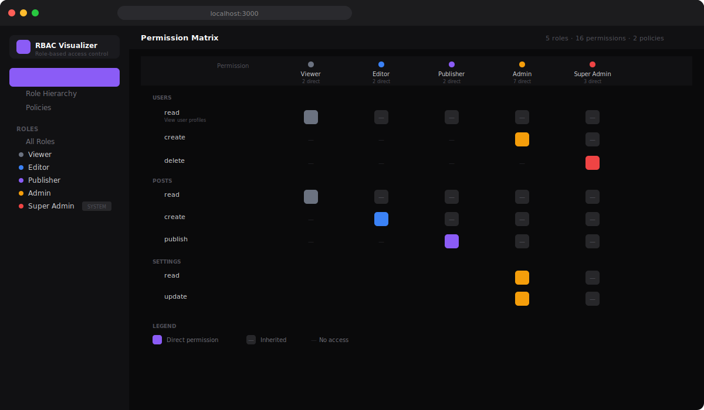

# RBAC Visualizer

Interactive tool to visualize and manage Role-Based Access Control configurations. See your permission matrix, role hierarchy, and policies at a glance.



## Features

- **Permission Matrix** — Visual grid showing which roles have which permissions (direct vs inherited)
- **Role Hierarchy** — Graph view of role inheritance chain with effective permission counts
- **Policy Editor** — View and manage access policies with conditions and effects
- **RBAC Engine** — Core logic for permission resolution, inheritance, and validation
- **Circular Detection** — Automatically detects circular inheritance and missing references
- **Sample Config** — Ships with a realistic 5-role, 16-permission example configuration

## Getting Started

```bash
git clone https://github.com/idirdev/rbac-visualizer.git
cd rbac-visualizer
npm install
npm run dev
```

Open [http://localhost:3000](http://localhost:3000).

## How it works

Define your RBAC configuration in `src/lib/sample-data.ts`:

```typescript
const config: RBACConfig = {
  roles: [
    {
      id: "editor",
      name: "Editor",
      inherits: ["viewer"],        // inherits all viewer permissions
      permissions: ["posts.create", "posts.update"],
    },
  ],
  permissions: [
    { id: "posts.create", resource: "posts", action: "create", description: "Create posts" },
  ],
  policies: [
    {
      name: "Editor Self-Edit Only",
      roles: ["editor"],
      permissions: ["posts.update"],
      conditions: [{ field: "post.authorId", operator: "eq", value: "{{userId}}" }],
      effect: "allow",
    },
  ],
};
```

The RBAC engine resolves effective permissions through inheritance and renders the visual matrix.

## RBAC Engine API

```typescript
import { RBACEngine } from "@/lib/rbac-engine";

const engine = new RBACEngine(config);

// Get all effective permissions (direct + inherited)
engine.getEffectivePermissions("admin"); // Set<string>

// Check specific permission
engine.hasPermission("editor", "posts.create"); // true

// Find where a permission comes from
engine.getPermissionSource("admin", "posts.read"); // "viewer" (inherited)

// Build full matrix
engine.buildMatrix(); // MatrixCell[]

// Validate config
engine.validate(); // string[] (errors)
```

## Tech Stack

- **Framework:** Next.js 14 (App Router)
- **Language:** TypeScript
- **Styling:** Tailwind CSS
- **Icons:** Lucide React

## Project Structure

```
src/
├── app/
│   ├── layout.tsx              # Root layout
│   ├── page.tsx                # Main page (view switching)
│   └── globals.css             # Global styles
├── components/
│   ├── sidebar.tsx             # Navigation + role list
│   ├── header.tsx              # Top bar with stats
│   ├── permission-matrix.tsx   # Permission grid view
│   ├── role-graph.tsx          # Role hierarchy visualization
│   └── policy-editor.tsx       # Policy cards with conditions
└── lib/
    ├── types.ts                # TypeScript interfaces
    ├── rbac-engine.ts          # Core RBAC logic
    ├── sample-data.ts          # Example configuration
    └── utils.ts                # Utility functions
```

## License

MIT — free to use, modify, and distribute.

## Export

Supports exporting the permission matrix as JSON or CSV.
